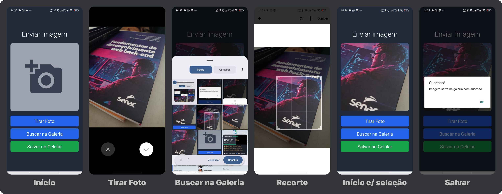

# Gerenciamento de Imagens com Expo (Câmera e Galeria)

Este projeto consiste em uma aplicação mobile desenvolvida em **React Native** com **Expo**, permitindo que o usuário tire fotos utilizando a câmera nativa do dispositivo, selecione imagens da galeria e salve os arquivos diretamente no armazenamento do celular.

* Esboço do professor

* Prints do projeto

---

## Bibliotecas Utilizadas

> Dica: O conteúdo abaixo traz um resumo dos principais métodos das bibliotecas utilizadas no projeto. Para consultar a documentação detalhada de cada uma, acesse o diretório [docs/](./docs/).

Para a manipulação e persistência das imagens, foram utilizadas duas bibliotecas oficiais do ecossistema Expo:

### 1. `expo-image-picker`
Responsável pela **captura e seleção de mídias**. Permite interagir diretamente com a câmera e com a biblioteca de fotos do sistema operacional.

* **`ImagePicker.requestCameraPermissionsAsync()`**: Solicita a autorização do usuário para acessar a câmera do dispositivo.
* **`ImagePicker.launchCameraAsync()`**: Abre a interface nativa da câmera para captura de fotos em tempo real.
* **`ImagePicker.requestMediaLibraryPermissionsAsync()`**: Solicita a autorização para leitura da galeria de fotos do celular.
* **`ImagePicker.launchImageLibraryAsync()`**: Abre a galeria nativa do dispositivo para que o usuário escolha uma imagem existente.

### 2. `expo-media-library`
Responsável pelo **armazenamento e persistência das mídias**. Permite criar e salvar arquivos diretamente na galeria do dispositivo.

* **`MediaLibrary.requestPermissionsAsync()`**: Solicita a autorização de escrita e acesso ao armazenamento do celular.
* **`MediaLibrary.createAssetAsync(uri)`**: Pega o arquivo temporário gerado pela câmera ou galeria e o grava de forma permanente na biblioteca do celular.

---

## Fluxo de Funcionamento

1. **Permissões:** Antes de qualquer ação visual ou de salvamento, o aplicativo checa e solicita as permissões necessárias ao sistema operacional (iOS/Android).
2. **Obtenção da Imagem:** O usuário escolhe entre tirar uma foto ou selecionar da galeria. O endereço do arquivo (`uri`) é armazenado no estado `imageUri` da aplicação.
3. **Exibição:** O aplicativo exibe uma prévia da imagem selecionada na tela.
4. **Persistência:** Ao clicar em salvar, o app pega o endereço da imagem e a grava de forma definitiva na galeria do celular.

---

## Tecnologias
* **React Native** (com TypeScript)
* **Expo Framework**
* **expo-image-picker**
* **expo-media-library**